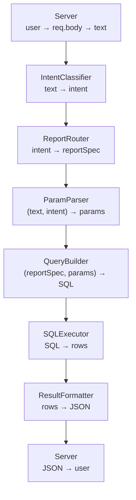

Grazie LLMREPORT, non solo perchè hai dato il via all'esplorazione fuori dalle colonne d'Ercole.

Ma anche perchè, nella quotidianità del progetto con il cliente, quanto provavamo assieme mi permetteva di apparire come un interlocutore credibile; non un esperto di LLM ma una persona che sapeva dialogare con un team IA con competenze molto verticali.

Ma cosa ho capito di tanto importante da questa applicazione, "spartana" fin quasi all'eccesso? 

Beh, intanto il flusso logico delle operazioni a cui dedicherò il seguente diagramma:



In pratica, il server estraeva la proprietà text dal body della request, dopodiché entravano in gioco i vari moduli con questi ruoli:

- intentClassifier: ricevere il testo e, chiamando Ollama, ritornare un intent fra quelli previsti, con un valore di confidenza o score;
- reportRouter: arricchire l’etichetta del report di intent con un json di nomi di parametri, obbligatori e opzionali;
- paramParser: ricevere il testo e l’intent selezionato e, chiamando Ollama, ritornare un json di nomi e valori dei parametri; 
- queryBuilder: trasformare la query descritta dal JSON ricevuto in una vera query SQL contenente anche i valori dei parametri;
- sqlExecutor: inviare la query SQL al DB e ricevere il recordset di risposta;
- reportFormatter: formattare il recordset come desiderato (in questo caso solo testo);

La function `intentClassifier` era basata su prompt per LLM idealmente blindato, come questo:

```javascript
  const prompt = `
  Sei un classificatore di intenti. Devi scegliere ESCLUSIVAMENTE uno dei seguenti intent:

  - CustomerProductRank
  - TopCustomersByRevenue
  - OrdersByPeriod

  REGOLE IMPORTANTI:
  - Rispondi SOLO con un JSON valido.
  - Nessun testo prima o dopo il JSON.
  - Nessuna spiegazione.
  - Nessun commento.
  - Nessun markdown.
  - Nessun campo diverso da "intent" e "confidence".
  - "intent" deve essere una stringa.
  - "confidence" deve essere un numero tra 0 e 1.

  Formato obbligatorio:
  {
    "intent": "...",
    "confidence": 0.0
  }

  Testo utente: "${text}"`;
```

Come immaginerete, il prompt faceva il suo lavoro spesso, ma non sempre.

Il `reportRouter` produceva quello che è stato chiamato reportSpec, una rappresentazione piatta e hardcoded delle sue caratteristiche utili alla produzione della corrispondente query. Ecco un esempio:

```javascript
CustomerProductRank: {
    report_id: "CustomerProductRank",
    description: "Mostra i prodotti più ordinati da un cliente specifico",
    required_params: ["customer_name"],
    optional_params: ["limit"],
    sql_template: null
  },
```

Era, per certi versi, un AST estremamente semplificato; di AST ne riparleremo, comunque, nei post successivi.

Le query erano scritte in Knex, di fatto per pura sperimentazione: l'unico DB previsto era SQLite, dunque la cosa più logica sarebbe stata utilizzare solo il suo "dialetto" di SQL.

Avevano pochissimi elementi di variabilità, gestiti con placeholder valorizzati dal `paramParser`, anch'esso basato su una chiamata diretta LLM e su un prompt teoricamente "a prova di allucinazioni".

Il `queryBuilder` era una sequenza di IF tipo quello riportato:

```javascript
if (reportId === 'CustomerProductRank') {
    const q = knex('Products as p')
      .select('p.id', 'p.name')
      .sum({ total_qty: 'ol.qty' })
      .join('OrderLines as ol', 'ol.product_id', 'p.id')
      .join('OrderHeaders as oh', 'ol.order_id', 'oh.id')
      .join('Customers as c', 'oh.customer_id', 'c.id')
      .where('c.name', params.customer_name)
      .groupBy('p.id')
      .orderBy('total_qty', 'desc')
      .limit(params.limit || 1)
      .toString();

    return { sql: q, bindings: [] };
  }
```

Il modulo `sqlExecutor`, infine, prendeva la stringa prodotta dal builder e la inviava, tramite la connessione, come comando al database.

Questo era più o meno tutto. 

Semplice e "geniale" ma... c'è sempre da stare in guardia quando le cose sembrano filare lisce al primo tentativo.

---

[← Torna all’Index](../index.md) · [Post successivo →](2026-06-28-la-posta-si-alza.md)


