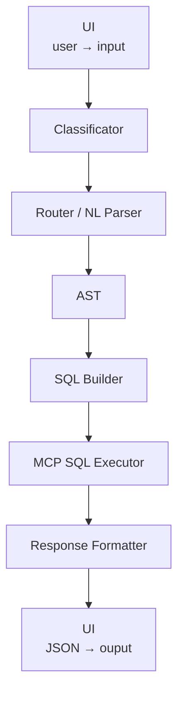

La prima cosa che avevo pensato di aggiungere ad LLMREPORT è stata, dunque, un modulo MCP (Meta Control Protocol). 

Questa parte, una volta scelto Node.js al posto dell'iniziale Python, non ha dato particolari problemi e mi ha lasciato la mia definizione personale di server MCP: "Un servizio HTTP che agisce per conto dell'LLM, che in pratica sa fare solo una cosa: generare testo".

Niente di mistico, dunque, e nemmeno di troppo differente da una Web API tradizionale, se non per l'uso specifico che se ne faceva.

L'introduzione dell'MCP, che incapsulava adesso la funzione di SQL Executor insieme ad alcuni comandi diretti tipo `/show_schema` o `/show_KPI`, introduceva una biforcazione nel flusso complessivo, visto che non aveva senso far passare queste istruzioni, interamente deterministiche, dall'LLM.

Ma era un po' poco, giusto? 

Così mi lanciai nella scrittura di una applicazione con questi obiettivi dichiarati:

- supporto a client grafico e visualizzazione delle risposte generate dall'LLM in *streaming token*, ovvero una parola dopo l'altra;
- passaggio ad intent più generici, che facessero capo ad una famiglia di report più che a report singoli;
- aggiunta delle facoltà di comprensione dello schema in modo che, cambiando lo schema, cambiasse automaticamente l'SQL generato;

Non ricordo i prompt che a suo tempo sottoposi a Copilot ma ricordo benissimo il tono delle risposte: "beh, si, dai: hai lavorato con gli intent, si tratta solo di dare una descrizione più puntuale della semantica e poi generare l'SQL a partire da quei metadati".

"Un descrizione più puntuale", e che ci vuole ... maledetto!

Per spiegare il mio ricordo non felicissimo devo introdurre, ora, due concetti in cui si concretizzava il concetto di *metadati* sopra espresso: 

- Semantic Layer (Insieme di files che descrivevano gli aspetti semantici come KPI e loro regole di calcolo, legami logici, sinonimi e via dicendo. Tutto quello che era indispensabile per produrre report dai dati ma non poteva essere contenuto in un DB fisico)
- AST (Abstract Syntax Tree, ossia rappresentazione strutturata ad albero di richieste in NL e loro elaborazione automatica attraverso la scansione delle stesse). 

Erano i pezzi fondamentali, insieme all'SQL Builder, della nuova applicazione, la cui *pipeline* principale aveva questa struttura elegante e promettente:

Aveva un solo problema: non funzionava neanche a pagarla ...

[← Torna all’Index](../index.md) · [Post successivo →](2026-07-03-a-pugni-con-tyson.md)